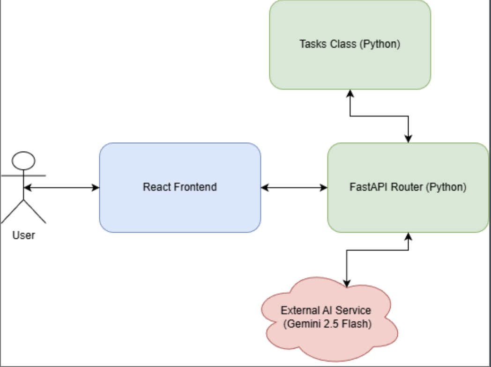

Team 26

# Project Name: Smart Task Planner
### Created By: Victor Barich, Evan Doubek, Nathaniel Dower, and Connor Magnuson

## Presentation and Purpose

The slides used in our presentation can be found [here](https://docs.google.com/presentation/d/1OZwi2Z-ybk9fOs_cixY3FHX43ESVyWq5gmGFgUmyoc0/edit?usp=sharing).

The initial project proposal can be found [here](https://docs.google.com/document/d/1074J4O0e7gWfi2qjdTWF0cls4lsr5AH7-7z5mLK8Nks/edit?usp=sharing).

This project helps users organize their life by providing a task list enhanced and automatically prioritized by AI. Users able able to add, delete, and complete tasks with an intuitive React web interface meanwhile tasks are retained and priorized using a Python backend.

## Technical Architecture

### Web-Based User Interface
* The user can create new tasks with the input form at the bottom of the page

* Clean and focused UI to maximize user experience and efficiency without distracting the user to prioritize productivity

* Automatically connects to the backend through FastAPI for seamless integration and smoothly handles all update and connection request statuses through user notifications

* Built in React by Connor

* Consistent 100% test coverage throughout development using React Testing Library

### REST-Style Backend API Service
* Correctly routes all data between client, internal, and external dependencies

* Robust and reliable

* Built in Python with FastAPI by Evan

### Object-Oriented Data Model
* Every task is put into a Task object and the collection of tasks is managed by the Tasks class

* Encapsulated behavior: each task is independent and managed uniformly

* Built in Python by Nate

### Gemini AI Integration Layer
* Connects to Gemini Flash 2.5 via API

* Leverages Gemini’s NLP capabilities to prioritize tasks based on attributes

* Modular: model can be easily updated or swapped based on user needs

* Built in Python with Google-GenAI by Victor

## Reproducible Installation Instructions

Begin by cloning this repository to your local machine.

### Starting the Backend

To begin, install Python on your system is it is not already installed.

`cd` into the `backend` directory and install the dependencies by running `pip install -r requriements.txt`. Note that `pip` may be called `pip3` on your machine depending on your Python installation and configuration.

If you would like to install the dependencies in a Python virtual environment, you can find instructions on doing so [here](https://www.w3schools.com/python/python_virtualenv.asp).

Next, follow the instructions in `backend/README.md` to create a secrets file with your AI api key.

Finally, start the backend by running `python main.py`. Note that `python` may be called `python3` on your machine depending on your Python installation and configuration. Note that you will need to keep this terminal window open to continue running the backend.

### Starting the Frontend

To begin, install npm on your machine if it is not already installed using the instructions [here](https://docs.npmjs.com/downloading-and-installing-node-js-and-npm).

`cd` into the `frontend` directory and run `npm i` to install the required dependencies.

Finally, start the frontend by running `npm run start`. The frontend should then be accessible at [http://localhost:3000](http://localhost:3000).

#### Running the Frontend Unit Tests

The frontend code has 100% test coverage. To run the tests, execute `npm test` and then press `a`. To receive a coverage report along with the test run, execute `npm test -- --coverage` and then press `a`.

### Connecting the Frontend and Backend

If the frontend and backend are running on the same machine, they should automatically connect. If the frontend is not connected to the backend, functionality will be limited and a warning will be shown to the user.

## Group Members and Their Roles
* **Victor Barich:** Responsible for AI integration with Gemini and AI task-prioritization code
* **Evan Doubek:** Responsible for FastAPI routes that connect the client requests to the task manager and AI prioritization
* **Nate Dower:** Responsible for backend encapsulated Task state management
* **Connor Magnuson:** Responsible for frontend design and development